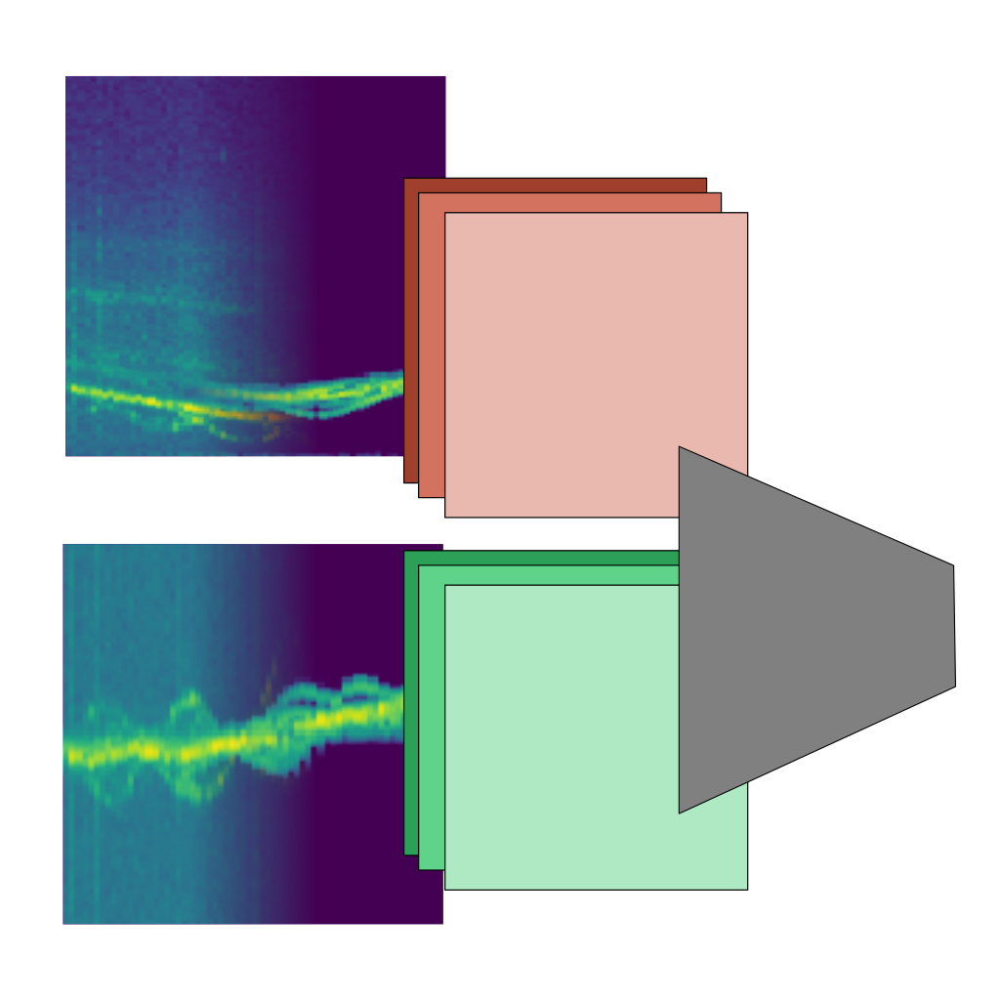
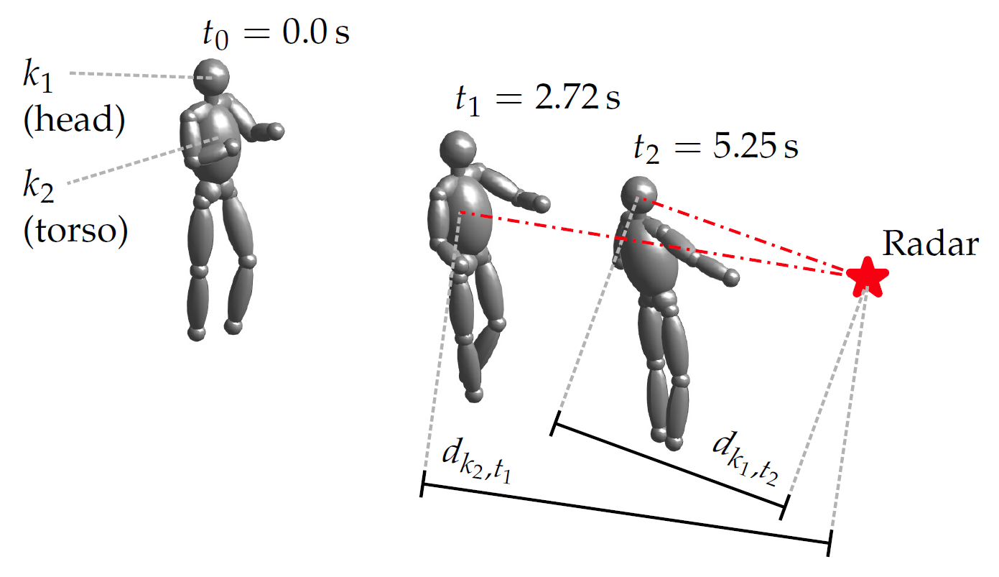
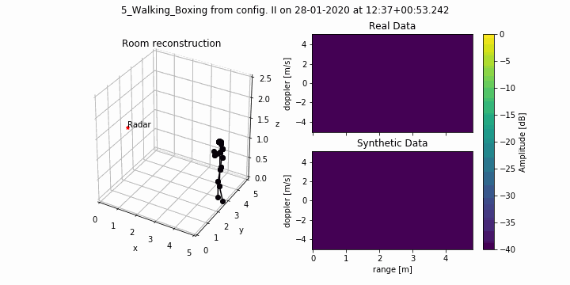
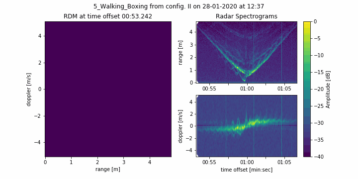
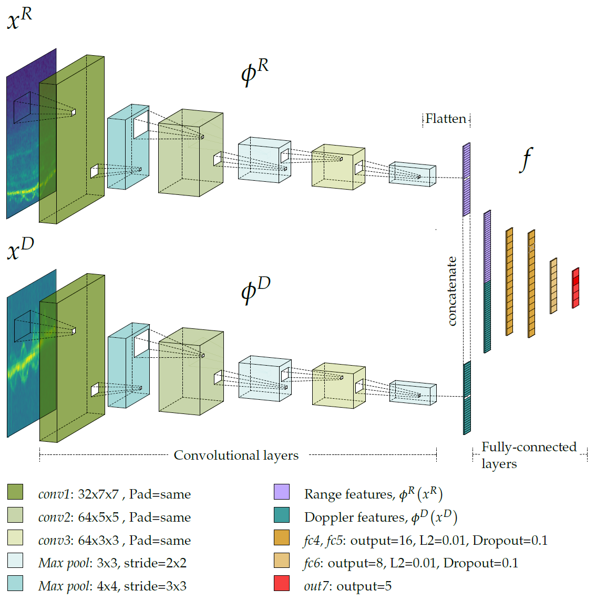
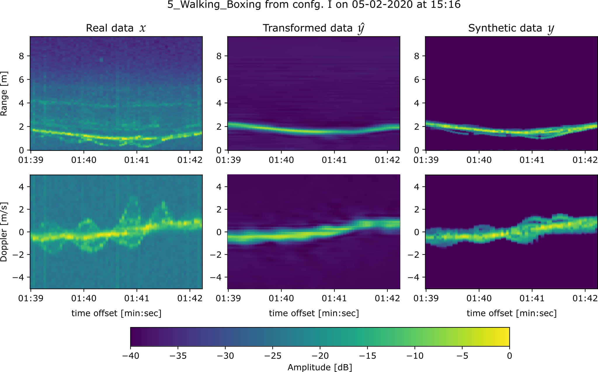

# RACPIT 
[][numpy]
[][pytorch]
[][pandas]

This repository contains supplementary material for our article
["Improving Radar Human Activity Classification
Using Synthetic Data with Image Transformation"](https://www.mdpi.com/1424-8220/22/4/1519),
published in
[MDPI Sensors](https://www.mdpi.com/journal/sensors)
as part of the
[Special Issue "Advances in Radar Sensors"](https://www.mdpi.com/journal/sensors/special_issues/radar_application). 
There we introduce **RACPIT**:
Radar Activity Classification with Perceptual Image Transformation,
a deep-learning approach to human activity classification using
[FMCW radar](https://community.infineon.com/t5/Knowledge-Base-Articles/Understanding-FMCW-Radars-Features-and-operational-principles/ta-p/767198)
and enhanced with synthetic data.

## Background

### Radar data

We use **Range Doppler Maps (RDMs)**
as a basis for our input data. These can be either real data acquired
with Infineon's
[Radar sensors for IoT](https://www.infineon.com/cms/en/product/sensor/radar-sensors/radar-sensors-for-iot/)
or synthetic using kinematic data with the following model:

$\Large s\left(t\right)=\sum_{k}{\sqrt{\frac{A_{k,t}}{L_{k,t}}}\sin{\left(2\pi f_{k,t}t+\phi_{k,t}\right)}}$

<div align=center>

</div>

$A_{k,t}$,
$L_{k,t}$,
$f_{k,t}$ and
$\phi_{k,t}$
represent the radar cross section, free-space path loss,
instant frequency and instant phase, respectively,
of the returned and mixed-down signal for every modelled human limb
$k$
and instant
$t$.
The latter three parameters depend
on the instantaneous distance of the limb to the radar sensor,
$d_{k,t}$,
and are calculated using the customary
[radar](https://www.radartutorial.eu/01.basics/The%20Radar%20Range%20Equation.en.html) and
[FMCW](https://www.radartutorial.eu/02.basics/Frequency%20Modulated%20Continuous%20Wave%20Radar.en.html)
equations.



We further preprocess the RDMs by stacking them and summing over Doppler and range axis
to obtain range and Doppler spectrograms, respectively:



### Deep learning

We train our image transformation networks with an adapted version of
[Perceptual Losses for Real-Time Style Transfer and Super-Resolution][perceptual].

[perceptual]: https://arxiv.org/abs/1603.08155


Since we are working with radar data, we substitute VGG16 as the perceptual network
with our two-branch convolutional neural network from
[Domain Adaptation Across Configurations of FMCW Radar for Deep Learning Based Human Activity Classification](https://doi.org/10.23919/IRS51887.2021.9466179).



If we train the image transformation networks with real data as our input and synthetic data as our ground truth,
we obtain a denoising behavior for the image transformation networks.



## Implementation

The code has been written for
PyTorch based on
[Daniel Yang's implementation](https://github.com/dxyang/StyleTransfer)
of [Perceptual loss][perceptual].

Data preprocessing is heavily based on
*x*array. You can take a closer look at it
in our
[example](./visualize).

### Prerequisites
- [Python 3.8](https://www.python.org/)
- [PyTorch 1.7.0][pytorch]
- [*x*array](https://xarray.pydata.org)
- [NumPy][numpy]
- [Pandas][pandas]
- [Matplotlib](https://matplotlib.org/)
- [Cuda 11.0](https://developer.nvidia.com/cuda-11.0-download-archive)
(For GPU training)

[numpy]: http://www.numpy.org/
[pytorch]: http://pytorch.org/
[pandas]: https://pandas.pydata.org/

### Usage

Radar data can be batch-preprocessed and stored
for faster training:

```bash
$ python utils/preprocess.py --raw "/path/to/data/raw" --output "/path/to/data/real" --value "db" --marginalize "incoherent"
$ python utils/preprocess.py --raw "/path/to/data/raw" --output "/path/to/data/synthetic" --synthetic --value "db" --marginalize "incoherent"
```

After this, you can train your CNN, that will serve as a perceptual network:

```bash
$ python main.py --log "cnn" train-classify --range --config "I" --gpu 0 --no-split --dataset "/path/to/data/synthetic"
```

Then you can train the image transformation networks:

```bash
$ python main.py --log "trans" train-transfer --range --config "I" --gpu 0 --visualize 5 --input "/path/to/data/real" --output "/path/to/data/synthetic" --recordings first --model "models/cnn.model"
```

And finally test the whole pipeline:

```bash
$ python main.py test --range --config "I" --gpu 0 --visualize 10 --dataset "/path/to/data/real" --recordings last --transformer "models/trans.model" --model "models/cnn.model"
```

## Citation

If you use RACPIT's code or you take the publication as a reference for your research,
please cite our work in the following way:

```bibtex
@Article{s22041519,
AUTHOR = {Hernang{\'o}mez, Rodrigo and Visentin, Tristan and Servadei, Lorenzo and Khodabakhshandeh, Hamid and Sta{\'n}czak, S{\l}awomir},
TITLE = {Improving Radar Human Activity Classification Using Synthetic Data with Image Transformation},
JOURNAL = {Sensors},
VOLUME = {22},
YEAR = {2022},
NUMBER = {4},
ARTICLE-NUMBER = {1519},
URL = {https://www.mdpi.com/1424-8220/22/4/1519},
ISSN = {1424-8220},
DOI = {10.3390/s22041519}
}
```
